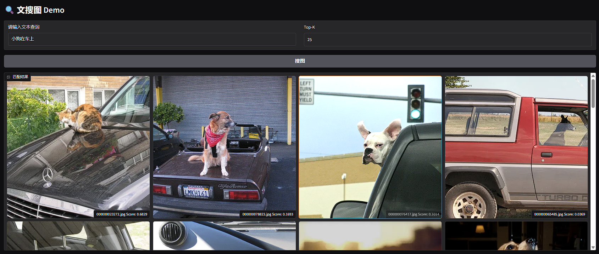

<p align="right">
  <a href="README_zh.md">中文</a> | <strong>English</strong>
</p>

## CLIP-based Image Search SDK for Axera NPU SoCs (AX650N / AX650A / AX8850N / AX8850)

This SDK enables efficient text-to-image retrieval using CLIP (Contrastive Language–Image Pretraining), optimized for Axera’s NPU-based SoC platforms including AX650, AX650C, AX8850, and AX650A, or Axera's dedicated AI accelerator.

With this SDK, you can:

- Perform semantic image search by providing natural language queries.

- Utilize CLIP to embed text queries and compare them against a pre-computed set of image embeddings.

- Run all inference processes directly on Axera NPUs for low-latency, high-throughput performance at the edge.

This solution is well-suited for smart cameras, content filtering, AI-powered user interfaces, and other edge AI scenarios where natural language-based image retrieval is required.

---

## SDK Architecture


## Build Instructions

### x86 Build

```bash
git clone --recursive https://github.com/AXERA-TECH/libclip.axera.git
cd libclip.axera
sudo apt install libopencv-dev build-essential 
./build.sh
```

### AArch64 Build

#### Cross-compile for aarch64

```bash
git clone --recursive https://github.com/AXERA-TECH/libclip.axera.git
cd libclip.axera
./build_aarch64.sh
```

#### Native Build on Target Board

```bash
git clone --recursive https://github.com/AXERA-TECH/libclip.axera.git
cd libclip.axera
sudo apt install libopencv-dev build-essential
./build.sh
```
---
## CI Status

| Architecture | Status |
|--------------|--------|
| x86          |  |
| aarch64      |  |

---
## Performance

| Model | Input Shape |  Latency (ms) | CMM Usage (MB) |
|-------|------------|--------------|------------|
| cnclip_vit_l14_336px_vision_u16u8.axmodel | 1 x 3 x 336 x 336 |  88.475 ms | 304 MB |
| cnclip_vit_l14_336px_text_u16.axmodel | 1 x 52 |  4.576 ms | 122 MB |
---

## Usage Example

### Get model
[clip](https://huggingface.co/AXERA-TECH/clip)

[cnclip](https://huggingface.co/AXERA-TECH/cnclip)

### On x86 (for development/testing)

```bash
./test_match_by_text \
  --ienc cnclip/cnclip_vit_l14_336px_vision_u16u8.axmodel \
  --tenc cnclip/cnclip_vit_l14_336px_text_u16.axmodel \
  --vocab cnclip/cn_vocab.txt \
  --db_path clip_feat_db/ \
  -i coco_1000/ \
  -t dog
```

### On Target Board (AX650/AX8850 etc.)

```bash
./test_match_by_text \
  --ienc cnclip/cnclip_vit_l14_336px_vision_u16u8.axmodel \
  --tenc cnclip/cnclip_vit_l14_336px_text_u16.axmodel \
  --vocab cnclip/cn_vocab.txt \
  --db_path clip_feat_db/ \
  -i coco_1000/ \
  -t dog
```

### Output Example

```
match text "dog"   8.86ms
|           key           | score |
|-------------------------|-------|
| 000000071226.jpg        |  0.16 |
| 000000052891.jpg        |  0.12 |
| 000000049269.jpg        |  0.11 |
| 000000078823.jpg        |  0.09 |
| 000000029393.jpg        |  0.07 |
| 000000023272.jpg        |  0.06 |
| 000000082807.jpg        |  0.05 |
| 000000107226.jpg        |  0.04 |
| 000000060835.jpg        |  0.04 |
| 000000076417.jpg        |  0.04 |
```

---

### Web demo(After `make install`)
```
pip install -r requirements.txt
python gradio_example.py --ienc cnclip/cnclip_vit_l14_336px_vision_u16u8.axmodel --tenc cnclip/cnclip_vit_l14_336px_text_u16.axmodel --vocab cnclip/cn_vocab.txt --isCN 1 --db_path clip_feat_db_coco --image_folder coco_1000/

* Running on local URL:  http://0.0.0.0:7860
* To create a public link, set `share=True` in `launch()`.
```

---
## Dependencies

* [OpenCV](https://opencv.org/)

---

## References

This project is based on the following open-source components:
* [CLIP](https://github.com/openai/CLIP): A multimodal model that can process both text and images.
* [Chinese-CLIP](https://github.com/OFA-Sys/Chinese-CLIP): A Chinese CLIP model with strong performance in Chinese text-image retrieval tasks.
* [LevelDB](https://github.com/google/leveldb): A fast key-value storage library used for storing image features.

---

## Community
QQ 群: 139953715
