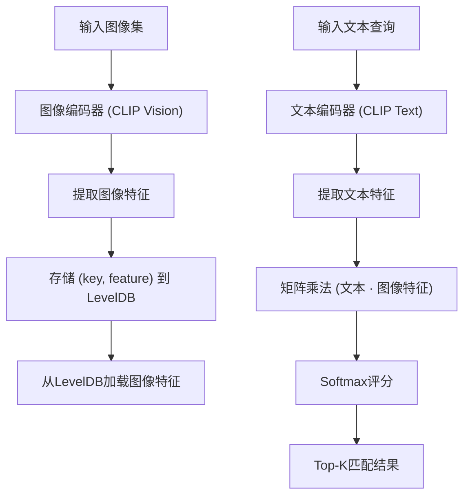
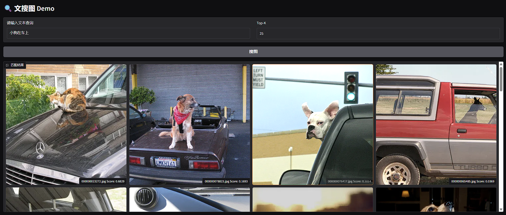

<p align="right">
  <a href="README.md">English</a> | <strong>中文</strong>
</p>

## 基于CLIP的Axera NPU SoCs(AX650N / AX650A / AX8850N / AX8850）图像搜索SDK

本SDK支持使用CLIP（对比语言-图像预训练）模型实现高效的文本到图像检索，专为Axera的NPU-based SoC平台（包括AX650、AX650C、AX8850和AX650A）或Axera专用AI加速器优化。

通过本SDK，您可以：

- 通过提供自然语言查询执行语义图像搜索
- 利用CLIP对文本查询进行嵌入，并与预先计算的图像嵌入集进行比较
- 所有推理过程直接在Axera NPU上运行，实现边缘端的低延迟、高吞吐量性能

该解决方案非常适合智能摄像头、内容过滤、AI驱动的用户界面以及其他需要基于自然语言的图像检索的边缘AI场景。

---

## SDK架构


## 构建说明

### 预构建二进制文件

- [x86](https://nightly.link/AXERA-TECH/libclip.axera/workflows/build/main/build-x86.zip)
- [aarch64](https://nightly.link/AXERA-TECH/libclip.axera/workflows/build/main/build-aarch64.zip)


### x86构建

```bash
git clone --recursive https://github.com/AXERA-TECH/libclip.axera.git
cd libclip.axera
sudo apt install libopencv-dev build-essential 
./build.sh
```

### AArch64构建

#### 交叉编译aarch64

```bash
git clone --recursive https://github.com/AXERA-TECH/libclip.axera.git
cd libclip.axera
./build_aarch64.sh
```

#### 在目标板上原生构建

```bash
git clone --recursive https://github.com/AXERA-TECH/libclip.axera.git
cd libclip.axera
sudo apt install libopencv-dev build-essential
./build.sh
```
---
## CI 状态

| Architecture | Status |
|--------------|--------|
| x86          |  |
| aarch64      |  |


---
## 性能

| Model | Input Shape |  Latency (ms) | CMM Usage (MB) |
|-------|------------|--------------|--------------|
| cnclip_vit_l14_336px_vision_u16u8.axmodel | 1 x 3 x 336 x 336 |  88.475 ms | 304 MB |
| cnclip_vit_l14_336px_text_u16.axmodel | 1 x 52 |  4.576 ms | 122 MB |
---

## 使用示例

### 获取模型
[clip](https://huggingface.co/AXERA-TECH/clip)

[cnclip](https://huggingface.co/AXERA-TECH/cnclip)

### 在x86上（用于开发/测试）

```bash
./test_match_by_text \
  --ienc cnclip/cnclip_vit_l14_336px_vision_u16u8.axmodel \
  --tenc cnclip/cnclip_vit_l14_336px_text_u16.axmodel \
  --vocab cnclip/cn_vocab.txt \
  --db_path clip_feat_db/ \
  -i coco_1000/ \
  -t dog
```

### 在目标板上（AX650/AX8850等）

```bash
./test_match_by_text \
  --ienc cnclip/cnclip_vit_l14_336px_vision_u16u8.axmodel \
  --tenc cnclip/cnclip_vit_l14_336px_text_u16.axmodel \
  --vocab cnclip/cn_vocab.txt \
  --db_path clip_feat_db/ \
  -i coco_1000/ \
  -t dog
```

### 输出示例
```
match text "dog"   8.86ms
|           key           | score |
|-------------------------|-------|
| 000000071226.jpg        |  0.16 |
| 000000052891.jpg        |  0.12 |
| 000000049269.jpg        |  0.11 |
| 000000078823.jpg        |  0.09 |
| 000000029393.jpg        |  0.07 |
| 000000023272.jpg        |  0.06 |
| 000000082807.jpg        |  0.05 |
| 000000107226.jpg        |  0.04 |
| 000000060835.jpg        |  0.04 |
| 000000076417.jpg        |  0.04 |
```
---
### Web demo（`make install` 之后使用）
```
pip install -r requirements.txt
python gradio_example.py --ienc cnclip/cnclip_vit_l14_336px_vision_u16u8.axmodel --tenc cnclip/cnclip_vit_l14_336px_text_u16.axmodel --vocab cnclip/cn_vocab.txt --isCN 1 --db_path clip_feat_db_coco --image_folder coco_1000/

* Running on local URL:  http://0.0.0.0:7860
* To create a public link, set `share=True` in `launch()`.
```


---
## 依赖项

* [OpenCV](https://opencv.org/)

---

## 参考资料

本项目基于以下开源组件：

* [CLIP](https://github.com/openai/CLIP): 一个多模态模型，能够同时处理文本和图像。
* [Chinese-CLIP](https://github.com/OFA-Sys/Chinese-CLIP): 一个中文CLIP模型，在中文文本-图像检索任务中表现出色。
* [LevelDB](https://github.com/google/leveldb): 一个快速的键值存储库，用于存储图像特征。

---

## 社区
QQ 群: 139953715